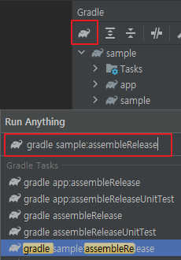

# Communicator

🌏 [English](README.en.md)

## 🚩 목차

* [개요](#개요)
* [스펙](#스펙)
* [API](#-api)
* [사용방법](#-사용방법)
* [Release notes](./ReleaseNotes.md)

## 개요

* Unity에서는 Native와 데이터를 주고 받을 수 있는 기능을 제공하고 있습니다.
* Android는 AndroidJavaClass를 이용하고, iOS는 DllImport를 이용해 Native와 연결합니다.
* Communicator는 Unity와 Native를 연결하는 기능과 공통화된 인터페이스를 제공해 데이터를 쉽게 주고받을 수 있습니다.

### 플러그인을 구현하는 일반적인 구조와 단점


* 플러그인 개발에 많은 리소스가 필요합니다.
    * Unity에서 AndroidJavaClass나 DllImport로 Native와의 연결이 필요합니다.
    * Native에서 Unity의 GameObject와 Callback을 등록해야 합니다.
    * Android의 경우 unity-classes.jar의 연결이 필요합니다.
    * Native 기능을 사용하는 Unity class에서 Callback 등록 등의 추가 작업이 필요합니다.
* 기능별로 개발된 플러그인은 많은 코드가 중복됩니다.

### Communicator의 구조와 사용 시 장점


* 통일된 인터페이스로 Native와 통신이 가능합니다.
    * ~~Unity에서 AndroidJavaClass나 DllImport로 Native와의 연결이 필요합니다.~~
    * ~~Native에서 Unity의 GameObject와 Callback을 등록해야 합니다.~~
    * ~~Android의 경우 unity-classes.jar의 연결이 필요합니다.~~
    * ~~Native 기능을 사용하는 Unity class에서 Callback 등록 등의 추가 작업이 필요합니다.~~

## 스펙

### Unity 지원 버전

* 2018.4.0 이상

## 🔨 API

### InitializeClass

Unity에서 보낸 메시지를 받을 Native Class를 생성합니다.

* Android의 경우 Package를 포함한 전체 경로와 Class 이름을 넣습니다.
* iOS의 경우 Class 이름만 넣습니다.

**API**

```cs
static void InitializeClass(GpmCommunicatorVO.Configuration configuration)
```

**Example**

```cs
public void Initialize()
{
    GpmCommunicatorVO.Configuration configuration = new GpmCommunicatorVO.Configuration()
    {
#if UNITY_ANDROID
        className = "${ANDROID_CLASS_NAME}"
#elif UNITY_IOS
        className = "${IOS_CLASS_NAME}"
#endif
    };
    
    GpmCommunicator.InitializeClass(configuration);
}
```

### AddReceiver

Native에서 보낸 메시지를 받을 Receiver를 등록합니다.

**API**
```cs
static void AddReceiver(string domain, GpmCommunicatorCallback.CommunicatorCallback callback)
```

**Example**
```cs
public void AddReceiver()
{
    GpmCommunicator.AddReceiver("${DOMAIN}", OnReceiver); 
}

private void OnReceiver(GpmCommunicatorVO.Message message)
{
    StringBuilder sb = new StringBuilder();

    sb.AppendLine();
    sb.AppendLine("OnReceiver");
    sb.AppendLine("Domain" + message.domain);
    sb.AppendLine("Data" + message.data);
    sb.AppendLine("Extra" + message.extra);

    Debug.Log(sb.ToString());
}
```

### CallSync

Native로 메시지를 전송합니다.
처리 결과를 즉시 리턴값으로 받을 수 있습니다.

**API**
```cs
public static GpmCommunicatorVO.Message CallSync(GpmCommunicatorVO.Message message)
```

**Example**
```cs
public void CallSync()
{
    GpmCommunicatorVO.Message message = new GpmCommunicatorVO.Message()
    {
        domain = "${DOMAIN}",
        data = "USER_SYNC_DATA",
        extra = "USER_SYNC_EXTRA"
    };

    GpmCommunicatorVO.Message responseMessage = GpmCommunicator.CallSync(message);

    StringBuilder sb = new StringBuilder();
    sb.AppendLine("CallSync Response");
    sb.AppendLine("Domain : " + responseMessage.domain);
    sb.AppendLine("Data : " + responseMessage.data);
    sb.AppendLine("Extra : " + responseMessage.extra);

    Debug.Log(sb.ToString());
}

```

### CallAsync

Native로 메시지를 전송합니다.
비동기 처리 결과를 AddReceiver API를 통해 등록한 Receiver를 통해 받을 수 있습니다.

**API**
```cs
static void CallAsync(GpmCommunicatorVO.Message message)
```

**Example**
```cs
public void CallAsync()
{
    GpmCommunicatorVO.Message message = new GpmCommunicatorVO.Message()
    {
        domain = "${DOMAIN}",
        data = "USER_ASYNC_DATA",
        extra = "USER_ASYNC_EXTRA"
    };

    GpmCommunicator.CallAsync(message);
}
```

## 🔨 사용 방법

### Communicator 설치

GPM Manager에서 Communicator를 설치합니다.

### Native Class 만들기

#### 1. Android

1. Android Studio로 프로젝트를 생성합니다. (e.g. com.gpm.communicator.sample)
2. 프로젝트 내에 폴더를 생성합니다. (e.g. Project/externalLibs)

    

3. Unity **Assets/GPM/Communicator/Plugins/Android/GpmCommunicatorPlugin.aar** 파일을 생성한 폴더에 복사합니다.
4. Android Studio에서 **File/New/New Module/Android Library**를 생성합니다.
5. GpmCommunicatorSample.java 파일을 생성하고 아래 코드를 붙여 넣습니다.

```java
// GpmCommunicatorSample.java 
// Package 경로를 확인합니다.
package com.gpm.communicator.sample;

import com.gpm.communicator.Interface.GpmCommunicatorReceiver;
import com.gpm.communicator.GpmCommunicatorPlugin;
import com.gpm.communicator.vo.GpmCommunicatorMessage;

public class GpmCommunicatorSample {
    private final String DOMAIN = "GPM_COMMUNICATOR_SAMPLE";

    public GpmCommunicatorSample() {
        // Receiver 생성
        GpmCommunicatorReceiver listener = new GpmCommunicatorReceiver() {
            @Override
            public void onRequestMessageAsync(GpmCommunicatorMessage message) {
                // Async Receiver 처리
                GpmCommunicatorPlugin.sendResponseMessage(message);
            }

            @Override
            public GpmCommunicatorMessage onRequestMessageSync(GpmCommunicatorMessage message) {
                // Sync Receiver 처리
                return message;
            }
        };

        // Receiver 등록
        GpmCommunicatorPlugin.addReceiver(DOMAIN, listener);
    }
}  
```
6. bundle.gradle 파일에 아래 구문을 추가합니다.

    

```java
dependencies {
    // Add
    compileOnly files('../externalLibs/GpmCommunicatorPlugin.aar')

    ...
}
```
7. gradle sync를 진행합니다.

    


8. aar 파일을 생성합니다.

    

9. 생성된 aar 파일을 Unity 프로젝트의 **Asset/Plugins/Android** 폴더에 넣습니다.

#### 2. iOS

Unity 프로젝트의 **Asset/Plugins/IOS** 폴더에 파일을 생성합니다.

```objc
// GPMCommunicatorSample.h
#import <Foundation/Foundation.h>

@interface GPMCommunicatorSample: NSObject
@end
```

```objc
// GPMCommunicatorSample.mm
#import "GPMCommunicatorSample.h"
#import "GPMCommunicator.h"
#import "GPMCommunicatorReceiver.h"
#import "GPMCommunicatorMessage.h"

#define GPM_COMMUNICATOR_SAMPLE_DOMAIN @"GPM_COMMUNICATOR_SAMPLE"

@implementation GPMCommunicatorSample

- (id)init {
    if((self = [super init]) == nil) {
        return nil;
    }
    
    // Creates a Receiver.
    GPMCommunicatorReceiver* receiver = [[GPMCommunicatorReceiver alloc] init];

    receiver.onRequestMessageSync = ^GPMCommunicatorMessage *(GPMCommunicatorMessage *message) {
        // Processes a Sync Message.
        return message;
    };

    receiver.onRequestMessageAsync = ^(GPMCommunicatorMessage *message) {
        // Processes a Async Message.
        [[GPMCommunicator sharedGPMCommunicator] sendResponseWithMessage:message];
    };

    // Registers a Receiver.
    [[GPMCommunicator sharedGPMCommunicator] addReceiverWithDomain:GPM_COMMUNICATOR_SAMPLE_DOMAIN receiver:receiver];
    return self;
}
@end
```

### Unity Class 만들기

Sample.cs를 만듭니다.

```cs
namespace Gpm.Communicator.Sample
{
    using UnityEngine;
    using Gpm.Communicator;
    using System.Text;

    public class Sample : MonoBehaviour
    {
        private const string DOMAIN = "GPM_COMMUNICATOR_SAMPLE";
        private const string ANDROID_CLASS_NAME = "com.gpm.communicator.sample.GpmCommunicatorSample";
        private const string IOS_CLASS_NAME = "GPMCommunicatorSample";

        private void Awake()
        {
            Initialize();
            AddReceiver();
        }

        /// <summary>
        /// Native class 초기화
        /// </summary>
        public void Initialize()
        {
            GpmCommunicatorVO.Configuration configuration = new GpmCommunicatorVO.Configuration()
            {
    #if UNITY_ANDROID
                className = ANDROID_CLASS_NAME
    #elif UNITY_IOS
                className = IOS_CLASS_NAME
    #endif
            };

            GpmCommunicator.InitializeClass(configuration);
        }

        /// <summary>
        /// Unity Receiver 등록
        /// </summary>
        public void AddReceiver()
        {
            GpmCommunicator.AddReceiver(DOMAIN, OnReceiver);
        }

        private void OnReceiver(GpmCommunicatorVO.Message message)
        {
            StringBuilder sb = new StringBuilder();

            sb.AppendLine();
            sb.AppendLine("OnReceiver");
            sb.AppendLine("Domain : " + message.domain);
            sb.AppendLine("Data : " + message.data);
            sb.AppendLine("Extra : " + message.extra);

            Debug.Log(sb.ToString());
        }

        /// <summary>
        /// Async 호출
        /// </summary>
        public void CallAsync()
        {
            GpmCommunicatorVO.Message message = new GpmCommunicatorVO.Message()
            {
                domain = DOMAIN,
                data = "USER_ASYNC_DATA",
                extra = "USER_ASYNC_EXTRA"
            };

            GpmCommunicator.CallAsync(message);
        }

        /// <summary>
        /// Sync 호출
        /// </summary>
        public void CallSync()
        {
            GpmCommunicatorVO.Message message = new GpmCommunicatorVO.Message()
            {
                domain = DOMAIN,
                data = "USER_SYNC_DATA",
                extra = "USER_SYNC_EXTRA"
            };

            GpmCommunicatorVO.Message responseMessage = GpmCommunicator.CallSync(message);

            StringBuilder sb = new StringBuilder();
            sb.AppendLine("CallSync Response");
            sb.AppendLine("Domain : " + responseMessage.domain);
            sb.AppendLine("Data : " + responseMessage.data);
            sb.AppendLine("Extra : " + responseMessage.extra);

            Debug.Log(sb.ToString());
        }
    }
}
```